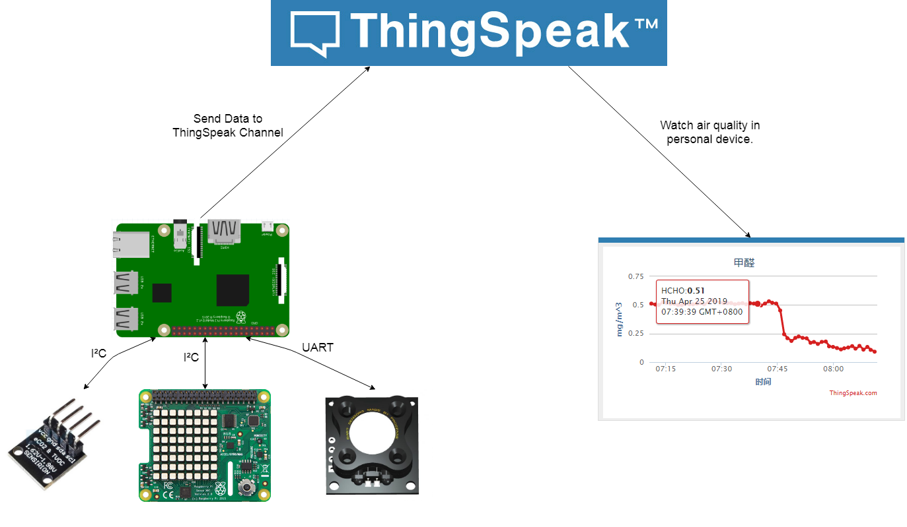

# 空气质量检测

基于树莓派的家庭空气质量检测系统，用于装修后空气质量检测。

### 基本情况
* **树莓派3B**作为总控
  * 采集各个传感器信息
  * 发送空气质量数据到ThingSpeak
* 使用**Dart WZ-S**检测甲醛
* 使用**SGP30**检测TVOC和二氧化碳
* 使用**Sense HAT**检测温度和湿度
  * 实际使用专门的传感器更好，采用Sense HAT只是因为正好有这个东西，

### 示意图

